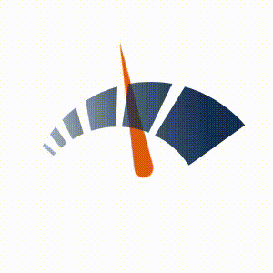

# chatmeter-svg-progress

Chatmeter SVG Progress UI Component for React

## Example

https://github.com/RommelTJ/chatmeter-svg-progress

## Screenshots



## Browsers

- support IE9+, Chrome, Firefox, Safari

## Usage

```js
import React from 'react';
import { ChatmeterProgress } from 'chatmeter-svg-progress';

export default () => <ChatmeterProgress />;
```

## Compatibility

| [](http://godban.github.io/browsers-support-badges/)<br>IE / Edge | [](http://godban.github.io/browsers-support-badges/)<br>Firefox | [](http://godban.github.io/browsers-support-badges/)<br>Chrome | [](http://godban.github.io/browsers-support-badges/)<br>Safari | [](http://godban.github.io/browsers-support-badges/)<br>Electron |
| -------------------------------------------------------------------------------------------------------------------------------------------------------------------------------------------------------------- | ---------------------------------------------------------------------------------------------------------------------------------------------------------------------------------------------------------------- | ------------------------------------------------------------------------------------------------------------------------------------------------------------------------------------------------------------ | ------------------------------------------------------------------------------------------------------------------------------------------------------------------------------------------------------------ | -------------------------------------------------------------------------------------------------------------------------------------------------------------------------------------------------------------------- |
| IE11, Edge                                                                                                                                                                                                     | last 2 versions                                                                                                                                                                                                  | last 2 versions                                                                                                                                                                                              | last 2 versions                                                                                                                                                                                              | last 2 versions                                                                                                                                                                                                      |

## API

### props

<table class="table table-bordered table-striped">
  <thead>
  <tr>
    <th style="width: 100px;">name</th>
    <th style="width: 50px;">type</th>
    <th style="width: 50px;">default</th>
    <th>description</th>
  </tr>
  </thead>
  <tbody>
    <tr>
      <td>mode</td>
      <td>String</td>
      <td>standard</td>
      <td>Supported methods. Can be 'standard', 'progress', or 'timed'.</td>
    </tr>
    <tr>
      <td>duration</td>
      <td>Number</td>
      <td>5</td>
      <td>Amount in seconds for the loader to go from 0% to 100% progress.</td>
    </tr>
    <tr>
      <td>begin</td>
      <td>Number</td>
      <td>0</td>
      <td>Delay in seconds for the animation to start.</td>
    </tr>
    <tr>
      <td>repeatCount</td>
      <td>Number or "indefinite"</td>
      <td>"indefinite"</td>
      <td>Number of times the animation is allowed to repeat.</td>
    </tr>
    <tr>
		  <td>from</td>
		  <td>Number</td>
		  <td>0</td>
		  <td>Initial rotation angle for the needle in the animation.</td>
		</tr>
    <tr>
      <td>to</td>
      <td>Number</td>
      <td>180</td>
      <td>Final rotation angle for the needle in the animation.</td>
    </tr>
    <tr>
      <td>progress</td>
      <td>Number</td>
      <td>undefined</td>
      <td>Used in conjunction with progress mode, allows to set the progress value manually.</td>
    </tr>
    <tr>
      <td>revAnimationThreshold</td>
      <td>Number</td>
      <td>undefined</td>
      <td>Used in conjunction with timed mode, allows to set the threshold for when the needle starts the revving animation.</td>
    </tr>
    <tr>
      <td>fireAnimationThreshold</td>
      <td>Number</td>
      <td>undefined</td>
      <td>Used in conjunction with timed mode, allows to set the threshold for when the needle starts the fire animations.</td>
    </tr>
  </tbody>
</table>

## Development

```
yarn install
yarn start
```

## License

chatmeter-svg-progress is released under the MIT license.
